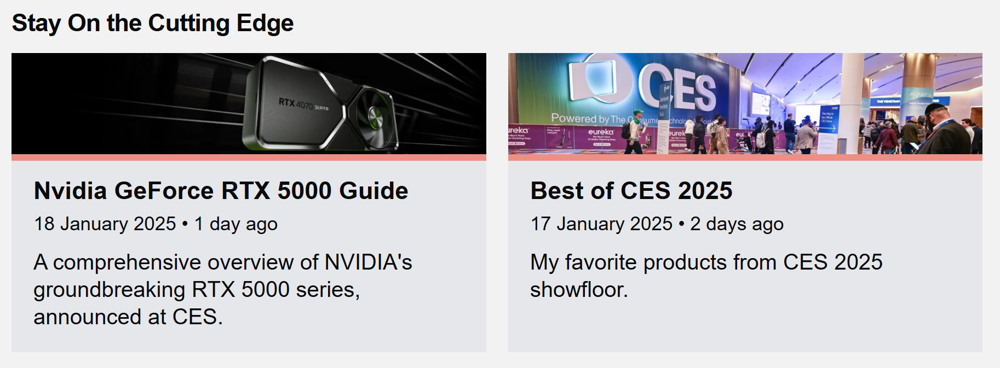

# nodebench.com

> Hardware reviews and technical articles for Indian audiences. Still in development.

## Live Website

Here is a main webapp: https://nodebench.com/

## Running Locally

1. Clone the repository:

   ```bash
   git clone https://github.com/prokits/nodebench-site.git
   cd nodebench-site
   ```

2. Install dependencies:

   ```bash
   npm install
   ```

3. Set up environment variables:

   - Copy `.env.example` to `.env.local`:
     ```bash
     cp .env.example .env.local
     ```
   - Update the following variables in `.env.local`:
     ```
     TURSO_DB_URL=           # Your Turso database URL
     TURSO_DB_AUTH_TOKEN=    # Your Turso auth token
     TURNSTILE_SITE_KEY=     # Cloudflare Turnstile site key
     TURNSTILE_SECRET_KEY=   # Cloudflare Turnstile secret key
     POSTHOG_KEY=            # PostHog project API key
     ```

4. Run the development server:

   ```bash
   npm run dev
   ```

5. Open [http://localhost:3000](http://localhost:3000) in your browser to see the result.

The app will use Turbopack in development for faster refresh times. Any changes you make to the files will be reflected immediately in the browser.

### Development

Want to contribute? Great!

To fix a bug or enhance an existing module, follow these steps:

- Fork the repo
- Create a new branch (`git checkout -b improve-feature`)
- Make the appropriate changes in the files
- Add changes to reflect the changes made
- Commit your changes (`git commit -am 'Improve feature'`)
- Push to the branch (`git push origin improve-feature`)
- Create a Pull Request

### Bug / Feature Request

If you find a bug (the website couldn't handle the query and / or gave undesired results), kindly open an issue [here](https://github.com/prokits/nodebench-site/issues/new) by including your search query and the expected result.

If you'd like to request a new function, feel free to do so by opening an issue [here](https://github.com/prokits/nodebench-site/issues/new). Please include sample queries and their corresponding results.

### Tech Stack

- [Next.js](https://nextjs.org/) - Frontend in React.js and serverless backend.
- [Turso](https://turso.tech/) - Edge SQLite database for storing benchmark data (yet to be implemented).
- [Drizzle ORM](https://orm.drizzle.team/) - TypeScript ORM for database operations.
- [Tailwind CSS](https://tailwindcss.com/) - Utility-first CSS framework.
- [MDX](https://mdxjs.com/) - Markdown with JSX for writing articles.
- [Shadcn & Radix UI](https://www.radix-ui.com/) - Unstyled, accessible UI components.
- [React Hook Form](https://react-hook-form.com/) - Form validation and handling.
- [Zod](https://zod.dev/) - TypeScript-first schema validation.
- [Cloudflare Turnstile](https://www.cloudflare.com/products/turnstile/) - Bot protection.
- [PostHog](https://posthog.com/) - Product analytics.

### Additional Scripts

- `npm run new-article` - Create a new article template with metadata and frontmatter.

### Creating Static Pages with UI Components

If you want to create a new page in the top level of the website (nodebench.com/<this_level>), There are serveral components available that
may help to format the page correctly.

The "@/components/ui/static-pages" file provides Main, Paragraph, Subtitle, Title components which are wrappers over existing standard HTML components with applied styles and proper formatting guidelines.

- Main - Wraps the whole page with a main tag with container tags and applied padding and margins. You should wrap your top-level pages with this component. Props: children and className.
- Title - Used for title of the page, displayed at the top after the nav. This is the main title. Should be ideally used once in the page. title prop is required.
- Subtitle - Any other title or heading on the page other than the main title. title prop is required.
- Paragraph - Any body of text. Wraps a p tag. props: children and className.

Here is a example page (/contact) that shows how to use these components:

```jsx
import { Main, Title, Subtitle, Paragraph } from "@/components/ui/static-pages";

export default function ContactPage() {
  <Main>
    <Title title="Contact Us" />
    <Paragraph className="mb-10">
      Have a burning tech question, want to discuss a hardware project, or just
      geek out about computers? I&apos;m all ears!
    </Paragraph>
    <Subtitle title="Email" />
    <Paragraph>Please mail us at our official mail id.</Paragraph>

    <Subtitle title="Social Media" />
    <Paragraph>
      You can also reach out to us on our social media handles.
    </Paragraph>
  </Main>;
}
```

### Style Guide

This project uses Tailwind CSS for styling. You can find the Tailwind CSS style guide [here](https://tailwindcss.com/docs).

Here are some additional guidelines:

#### Cards

The background of the cards is gray-200. The padding is 4.


## Articles

The articles are written in Markdown but you are free to use any valid JSX in the markdown file. The articles are in the app/(app)/articles/ directory. Each article has its own directory with a page.mdx file, you can create this file using the `npm run new-article` command. This command will also create a image folder in the public/articles directory with the same name as the article directory. You should put all images you want to use in page.mdx file here.

There are some components which are automatically added in the page.mdx file.

- Next.js Metadata - This is the standard metadata for the page. This is also used for creating metadata for articles in the public/data/articles.json file.

- articleInfo - This is the metadata for the article. This is used to create the article card in the homepage. It takes the following props:
  - type - The type of the article. This is used to filter the articles in the homepage. There are two types, 'blog' and 'article'. This is used to filter articles for search and other pages.
  - thumbnail - The thumbnail of the article.

- Topbar - This component is used to display the topbar of the article. It takes the following props:
  - thumbnail - The thumbnail of the article.
  - title - The title of the article.
  - author - The author of the article.
  - date - The date of the article.

- Content - This is the main content wrapper. It wraps the MainContent and Tldr components. This is mainly for layout purposes.
  - MainContent - This is the main content of the article. This is where you should put the main content of the article.
  - Tldr - This is the TLDR of the article. This is displayed along side the main content in the article card. This component also has links and cards for other articles and reviews.

- AuthorCard - This is the author card of the article. It takes the following props:
  - authorSlug - The slug of the author. The author data is defined in app\(app)\articles\_components\Content.tsx

#### Example Structure of an Article
```mdx
import Topbar from '../_components/Topbar.tsx'
import {Content, MainContent, Tldr, AuthorCard} from "../_components/Content.tsx"

export const metadata = {
    title: 'Nvidia GeForce RTX 5000 Guide',
    description: "A comprehensive overview of NVIDIA's groundbreaking RTX 5000 series, announced at CES.",
    date: '2025-01-18',
    authors: [{name: "Tushar Gaurav", url: "https://tushgaurav.in"}],
}

export const articleInfo = {
    type: 'blog',
    thumbnail: "/images/articles/nvidia-geforce-rtx-5000-guide/thumbnail.png"
}

<Topbar
    thumbnail='/images/articles/nvidia-geforce-rtx-5000-guide/thumbnail.png'
    title="Nvidia GeForce RTX 5000 Guide"
    author='Tushar Gaurav'
    date='2025-01-17'
/>

<Content>

<MainContent>
Main content of the article goes here.
</MainContent>

<Tldr>
This is the TLDR of the article.
</Tldr>

</Content>

<AuthorCard authorSlug="tushgaurv" />
```